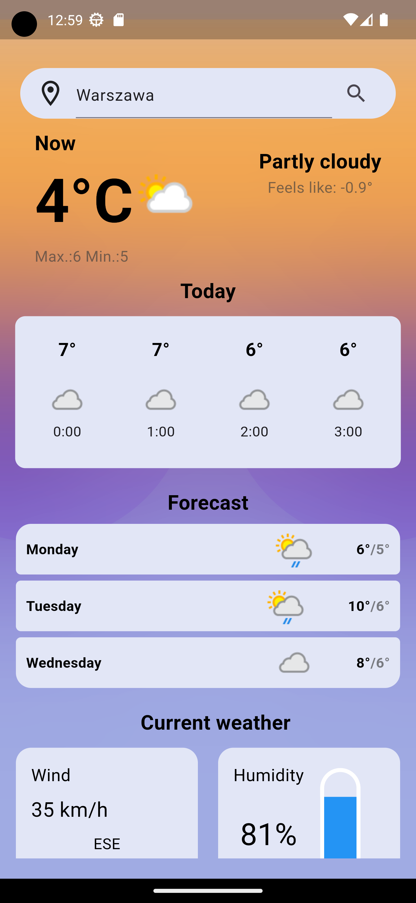
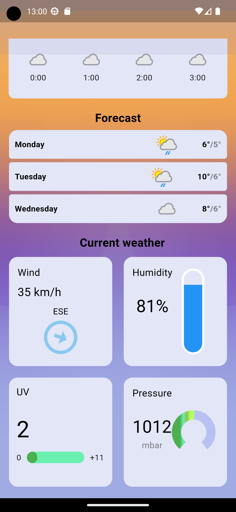
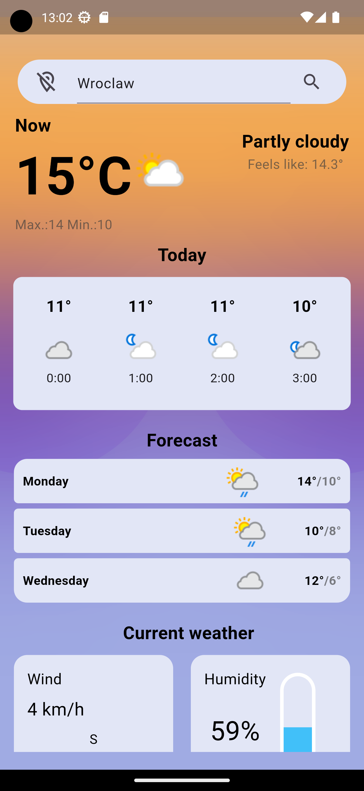

# Weather Application

## Table of contents
* [Overview](#overview)
* [Used technologies](#used-technologies)
* [Design](#design)
* [Diagram](#diagram)
* [Setup](#setup)

## Overview

To create a weather mobile app, using the free weatherapi.com API. The app allows users to observe current weather conditions based on their current location or manually searched locations.

### Used technologies

- The app is built using the bloc architecture from the flutter_bloc package

### Design

Displayed information includes the current temperature, maximum and minimum temperatures for the day, and the feels like temperature. The weather icon and a brief description also change based on the current weather conditions. Hourly temperatures and weather icons for the day are presented below. The weather forecast covers 3 days, showing the weather icon, maximum and minimum temperatures for each day. Charts for current atmospheric conditions include wind speed, humidity, UV index, and pressure.

### Setup

To use the app, users need to create a free account on weatherapi.com and obtain an access key. Then, in the path ./mobile/lib/api, add a file named api_key.dart and enter the key in the following format: final tmdbApiKey = 'YOUR KEY';
